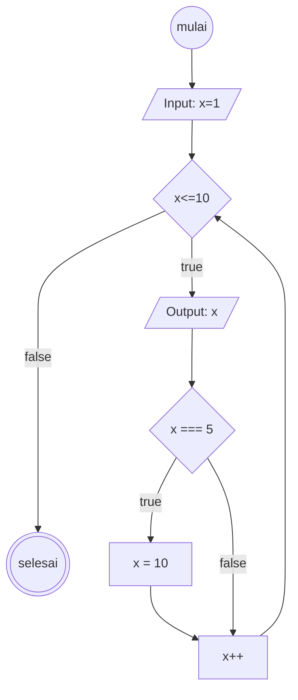

## For Loop

```mermaid
flowchart TD
    mulai@{ shape: circle}
    inisiasi@{ shape: lean-r, label: "Input: x=1"}
    if@{ shape: diamond, label: "x<=10"}
    do@{ shape: lean-r, label: "Output: x"}
    ifx@{ shape: diamond, label: "x === 5"}
    ifxTrue@{ label: "x = 10"}
    iterasi@{ label: "x++"}
    selesai@{ shape: dbl-circ}
mulai-->inisiasi-->if
if--false---->selesai
if--true-->do-->ifx
ifx--true-->ifxTrue-->iterasi-->if
ifx--false-->iterasi
```