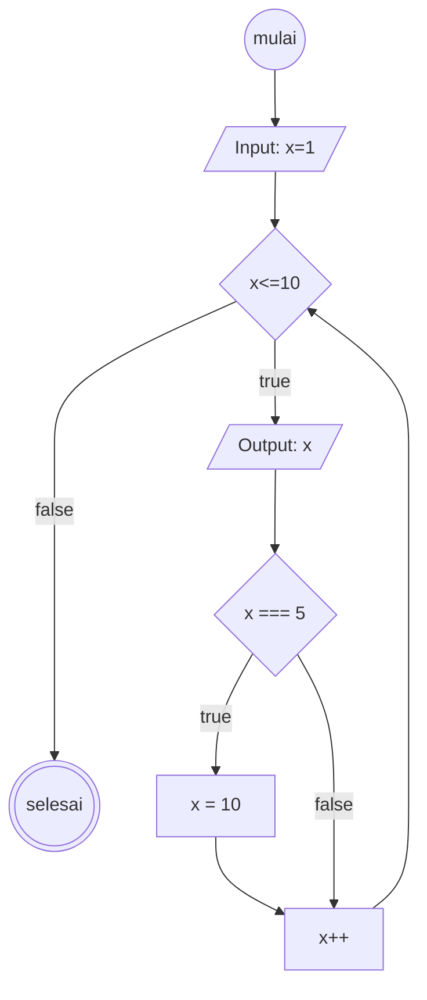
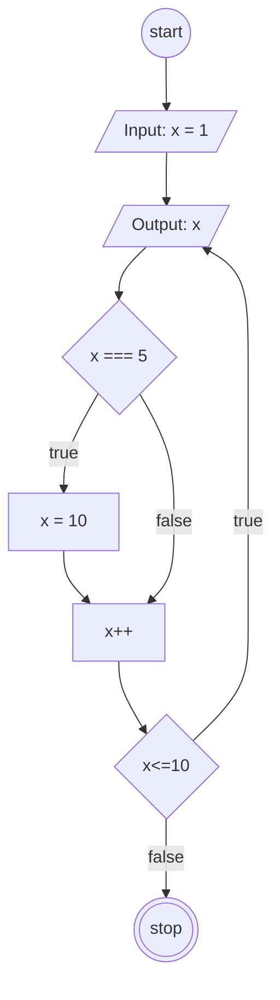

## For Loop

```mermaid
flowchart TD
    mulai@{ shape: circle}
    inisiasi@{ shape: lean-r, label: "Input: x=1"}
    if@{ shape: diamond, label: "x<=10"}
    do@{ shape: lean-r, label: "Output: x"}
    ifx@{ shape: diamond, label: "x === 5"}
    ifxTrue@{ label: "x = 10"}
    iterasi@{ label: "x++"}
    selesai@{ shape: dbl-circ}
mulai-->inisiasi-->if
if--false---->selesai
if--true-->do-->ifx
ifx--true-->ifxTrue-->iterasi-->if
ifx--false-->iterasi
```

## Do While Loop

```mermaid
flowchart TD
    start@{ shape: circle}
    inisiate@{ shape: lean-r, label: "Input: x = 1"}
    if@{ shape: diamond, label: "x<=10"}
    do@{ shape: lean-r, label: "Output: x"}
    ifx@{ shape: diamond, label: "x === 5"}
    ifxTrue@{ label: "x = 10"}
    iterasi@{ label: "x++"}
    stop@{ shape: dbl-circ}

start-->inisiate-->do-->ifx
ifx--true-->ifxTrue-->iterasi
ifx--false-->iterasi-->if
if--true-->do
if--false-->stop
```