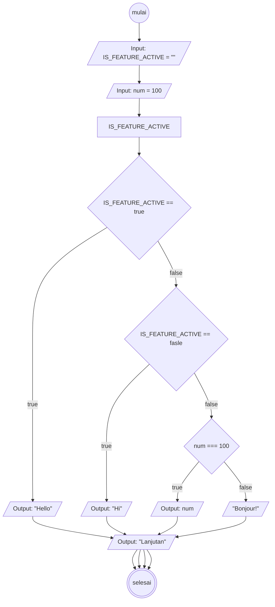

```mermaid
flowchart TD
    mulai@{ shape: circle}
    input@{ shape: lean-r, label: "Input: IS_FEATURE_ACTIVE = #quot;#quot;"}
    input2@{ shape: lean-r, label: "Input: num = 100"}
    switch@{ label: IS_FEATURE_ACTIVE }
    case1@{ shape: diamond, label: "IS_FEATURE_ACTIVE == true"}
    case1True@{ shape: lean-r, label: "Output: #quot;Hello#quot;"}
    case2@{ shape: diamond, label: "IS_FEATURE_ACTIVE == fasle"}
    case2True@{ shape: lean-r, label: "Output: #quot;Hi#quot;"}
    default@{ shape: diamond, label: "num === 100"}
    ifTrue@{ shape: lean-r, label: "Output: num"}
    ifFalse@{ shape: lean-r, label: "#quot;Bonjour!#quot;"}
    selesai@{ shape: dbl-circ}
    output@{ shape: lean-r, label: "Output: #quot;Lanjutan#quot;"}

mulai-->input-->input2-->switch-->case1
case1--true-->case1True-->output-->selesai
case1--false-->case2
case2--true-->case2True-->output-->selesai
case2--false-->default
default--true-->ifTrue-->output-->selesai
default--false-->ifFalse-->output-->selesai
```