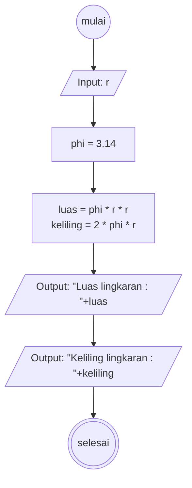

# Algoritma Javascript1

## Task 1 

```mermaid
flowchart TD
    mulai@{ shape: circle}
    input@{ shape: lean-r, label: "Input: r"}
    phi@{ label: "phi = 3.14"}
    rumus@{ label: "luas = phi * r * r
    keliling = 2 * phi * r"}
    output1@{ shape: lean-r, label: "Output: #quot;Luas lingkaran : #quot;+luas"}
    output2@{ shape: lean-r, label: "Output: #quot;Keliling lingkaran : #quot;+keliling"}
    selesai@{ shape: dbl-circ}

    mulai-->input-->phi-->rumus
    rumus-->output1-->output2-->selesai
```