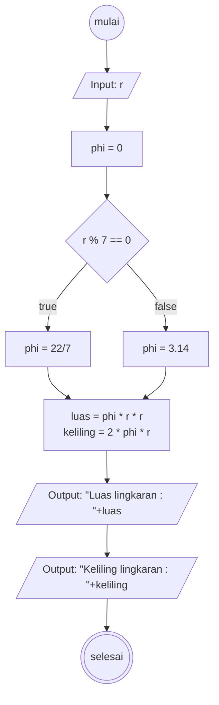

# Algoritma Javascript1

## Task 1 

```mermaid
flowchart TD
    mulai@{ shape: circle}
    input@{ shape: lean-r, label: "Input: r"}
    letphi@{ label: "phi = 0"}
    if@{ shape: diamond, label: "r % 7 == 0"}
    phi1@{ label: "phi = 3.14"}
    phi2@{ label: "phi = 22/7"}
    rumus@{ label: "luas = phi * r * r
    keliling = 2 * phi * r"}
    output1@{ shape: lean-r, label: "Output: #quot;Luas lingkaran : #quot;+luas"}
    output2@{ shape: lean-r, label: "Output: #quot;Keliling lingkaran : #quot;+keliling"}
    selesai@{ shape: dbl-circ}

    mulai-->input-->letphi-->if
    if--false-->phi1
    if--true-->phi2
    phi2-->rumus
    phi1-->rumus
    rumus-->output1-->output2-->selesai
```