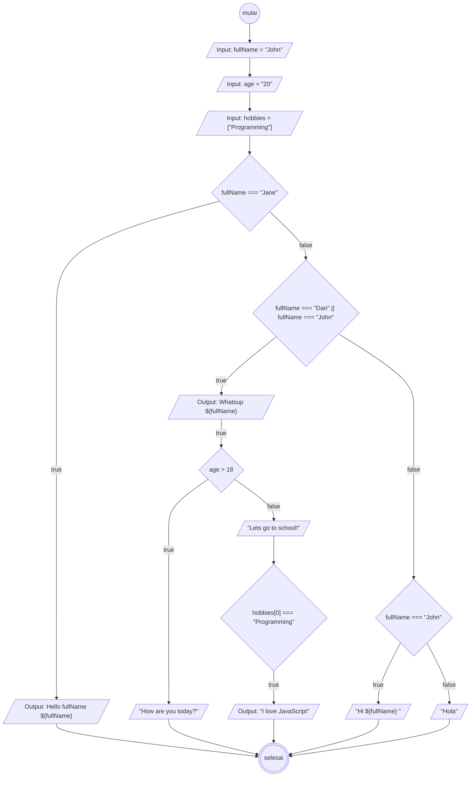

```mermaid
flowchart TD
    mulai@{ shape: circle}
    inputName@{ shape: lean-r, label: "Input: fullName = #quot;John#quot;"}
    inputAge@{ shape: lean-r, label: "Input: age = #quot;20#quot;"}
    inputHobbies@{ shape: lean-r, label: "Input: hobbies = [#quot;Programming#quot;]"}
    ifJane@{ shape: diamond, label: "fullName === #quot;Jane#quot;"}
    trueJane@{ shape: lean-r, label: "Output: Hello fullName ${fullName}"}
    falseJane@{ shape: diamond, label: "fullName === #quot;Dan#quot; || fullName === #quot;John#quot;"}
    trueDan1@{ shape: lean-r, label: "Output: Whatsup ${fullName}"}
    ifAge@{ shape: diamond, label: "age > 18"}
    ageTrue@{ shape: lean-r, label: "#quot;How are you today?#quot;"}
    ageFalse@{ shape: lean-r, label: "#quot;Lets go to school!#quot;"}
    ifHobbies@{ shape: diamond, label: "hobbies[0] === #quot;Programming#quot;"}
    hobbiesTrue@{ shape: lean-r, label: "Output: #quot;I love JavaScript#quot;"}
    falseDan@{ shape: diamond, label: "fullName === #quot;John#quot;"}
    trueJohn@{ shape: lean-r, label: "#quot;Hi ${fullName} #quot;"}
    falseJohn@{ shape: lean-r, label: "#quot;Hola#quot;"}
    selesai@{ shape: dbl-circ}


    mulai-->inputName-->inputAge-->inputHobbies-->ifJane
    ifJane--true-->trueJane-->selesai
    ifJane--false-->falseJane--true-->trueDan1
    trueDan1--true-->ifAge
    ifAge--true-->ageTrue-->selesai
    ifAge--false-->ageFalse-->ifHobbies
    ifHobbies--true-->hobbiesTrue-->selesai
    falseJane--false-->falseDan--true-->trueJohn-->selesai
    falseDan--false-->falseJohn-->selesai
```