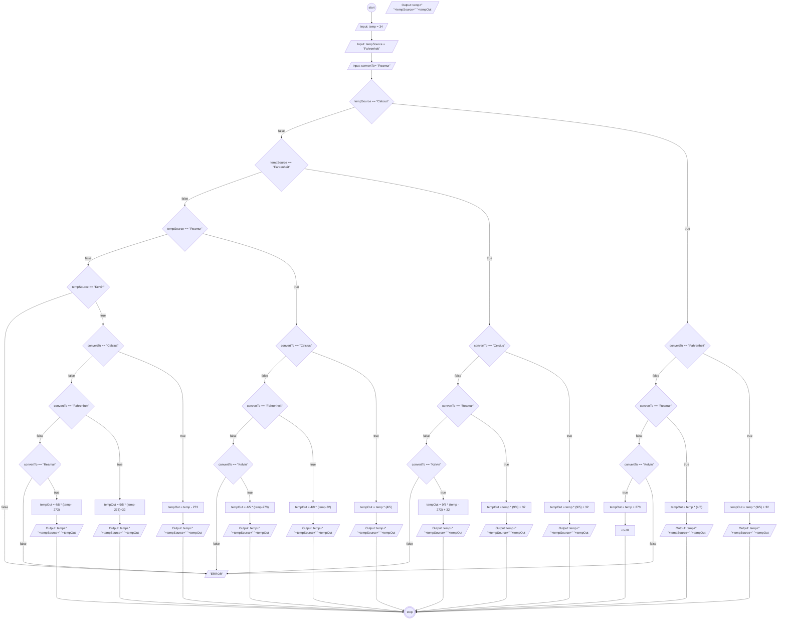

# Task 4
## Flowchart

```mermaid
flowchart TD
    start@{ shape: circle}
    input1@{ shape: lean-r, label: "Input: temp = 34"}
    input2@{ shape: lean-r, label: "Input: tempSource = #quot;Fahrenheit#quot;"}
    input3@{ shape: lean-r, label: "Input: convertTo=  #quot;Reamur#quot;"}
    error@{ shape: lean-r, label: "#quot;ERROR#quot;"}
    stop@{ shape: dbl-circ}

    ifSource1@{ shape: diamond, label: "tempSource == #quot;Celcius#quot;"}
    ifSource2@{ shape: diamond, label: "tempSource == #quot;Fahrenheit#quot;"}
    ifSource3@{ shape: diamond, label: "tempSource == #quot;Reamur#quot;"}
    ifSource4@{ shape: diamond, label: "tempSource == #quot;Kelvin#quot;"}

    ifCelcius1@{ shape: diamond, label: "convertTo == #quot;Fahrenheit#quot;"}
    ifCelcius2@{ shape: diamond, label: "convertTo == #quot;Reamur#quot;"}
    ifCelcius3@{ shape: diamond, label: "convertTo == #quot;Kelvin#quot;"}

    celciusF@{ label: "tempOut = temp * (9/5) + 32"}
    celciusR@{ label: "tempOut = temp * (4/5)"}
    celciusK@{ label: "tempOut = temp + 273"}
    cOutF@{ shape: lean-r, label: "Output: temp+#quot; #quot;+tempSource+#quot; #quot;+tempOut"}
    cOutR@{ shape: lean-r, label: "Output: temp+#quot; #quot;+tempSource+#quot; #quot;+tempOut"}
    cOutK@{ shape: lean-r, label: "Output: temp+#quot; #quot;+tempSource+#quot; #quot;+tempOut"}


    ifFahrenheit1@{ shape: diamond, label: "convertTo == #quot;Celcius#quot;"}
    ifFahrenheit2@{ shape: diamond, label: "convertTo == #quot;Reamur#quot;"}
    ifFahrenheit3@{ shape: diamond, label: "convertTo == #quot;Kelvin#quot;"}

    fahrenheitC@{ label: "tempOut = temp * (9/5) + 32"}
    fahrenheitR@{ label: "tempOut = temp * (9/4) + 32"}
    fahrenheitK@{ label: "tempOut = 9/5 * (temp - 273) + 32"}
    fOutC@{ shape: lean-r, label: "Output: temp+#quot; #quot;+tempSource+#quot; #quot;+tempOut"}
    fOutR@{ shape: lean-r, label: "Output: temp+#quot; #quot;+tempSource+#quot; #quot;+tempOut"}
    fOutK@{ shape: lean-r, label: "Output: temp+#quot; #quot;+tempSource+#quot; #quot;+tempOut"}


    ifReamur1@{ shape: diamond, label: "convertTo == #quot;Celcius#quot;"}
    ifReamur2@{ shape: diamond, label: "convertTo == #quot;Fahrenheit#quot;"}
    ifReamur3@{ shape: diamond, label: "convertTo == #quot;Kelvin#quot;"}

    reamurC@{ label: "tempOut = temp * (4/5)"}
    reamurF@{ label: "tempOut = 4/9 * (temp-32)"}
    reamurK@{ label: "tempOut = 4/5 * (temp-273)"}
    rOutC@{ shape: lean-r, label: "Output: temp+#quot; #quot;+tempSource+#quot; #quot;+tempOut"}
    rOutF@{ shape: lean-r, label: "Output: temp+#quot; #quot;+tempSource+#quot; #quot;+tempOut"}
    rOutK@{ shape: lean-r, label: "Output: temp+#quot; #quot;+tempSource+#quot; #quot;+tempOut"}


    ifKelvin1@{ shape: diamond, label: "convertTo == #quot;Celcius#quot;"}
    ifKelvin2@{ shape: diamond, label: "convertTo == #quot;Fahrenheit#quot;"}
    ifKelvin3@{ shape: diamond, label: "convertTo == #quot;Reamur#quot;"}

    kelvinC@{ label: "tempOut = temp - 273"}
    kelvinF@{ label: "tempOut = 9/5 * (temp-273)+32"}
    kelvinR@{ label: "tempOut = 4/5 * (temp - 273)"}
    kOutC@{ shape: lean-r, label: "Output: temp+#quot; #quot;+tempSource+#quot; #quot;+tempOut"}
    kOutF@{ shape: lean-r, label: "Output: temp+#quot; #quot;+tempSource+#quot; #quot;+tempOut"}
    kOutR@{ shape: lean-r, label: "Output: temp+#quot; #quot;+tempSource+#quot; #quot;+tempOut"}


start-->input1-->input2-->input3-->ifSource1

ifSource1--false-->ifSource2
ifSource1--true-->ifCelcius1
ifCelcius1--false-->ifCelcius2
ifCelcius1--true-->celciusF-->cOutF------->stop
ifCelcius2--false-->ifCelcius3
ifCelcius2--true-->celciusR-->cOutR------->stop
ifCelcius3--true-->celciusK-->coutK------->stop
ifCelcius3--false------>error

ifSource2--false-->ifSource3
ifSource2--true-->ifFahrenheit1
ifFahrenheit1--false-->ifFahrenheit2
ifFahrenheit1--true-->fahrenheitC-->fOutC------->stop
ifFahrenheit2--false-->ifFahrenheit3
ifFahrenheit2--true-->fahrenheitR-->fOutR------->stop
ifFahrenheit3--false------>error
ifFahrenheit3--true-->fahrenheitK-->fOutK------->stop

ifSource3--false-->ifSource4
ifSource3--true-->ifReamur1
ifReamur1--false-->ifReamur2
ifReamur1--true-->reamurC-->rOutC------->stop
ifReamur2--false-->ifReamur3
ifReamur2--true-->reamurF-->rOutF------->stop
ifReamur3--false------>error
ifReamur3--true-->reamurK-->rOutK------->stop

ifSource4--false---->error
ifSource4--true-->ifKelvin1
ifKelvin1--false-->ifKelvin2
ifKelvin1--true-->kelvinC-->kOutC------->stop
ifKelvin2--false-->ifKelvin3
ifKelvin2--true-->kelvinF-->kOutF------->stop
ifKelvin3--false------>error
ifKelvin3--true-->kelvinR-->kOutR------->stop

```